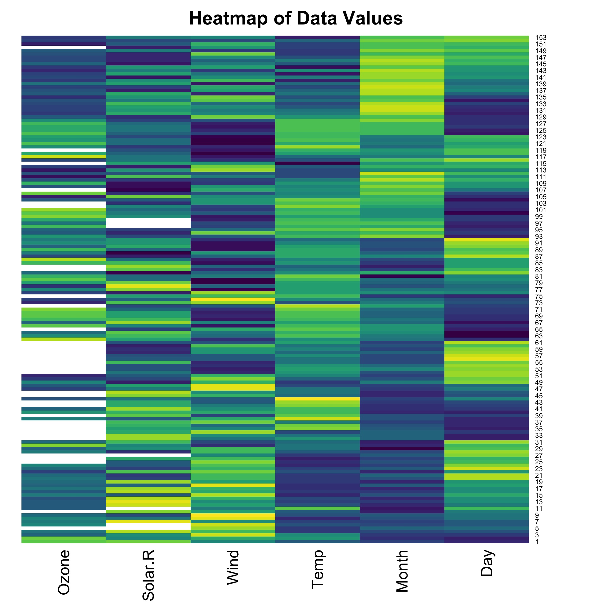
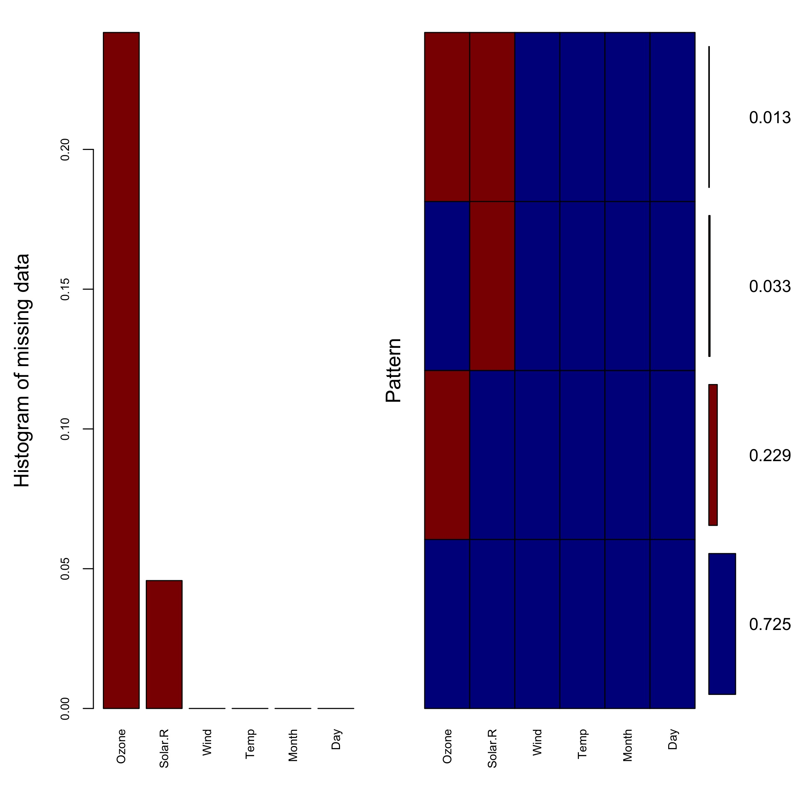
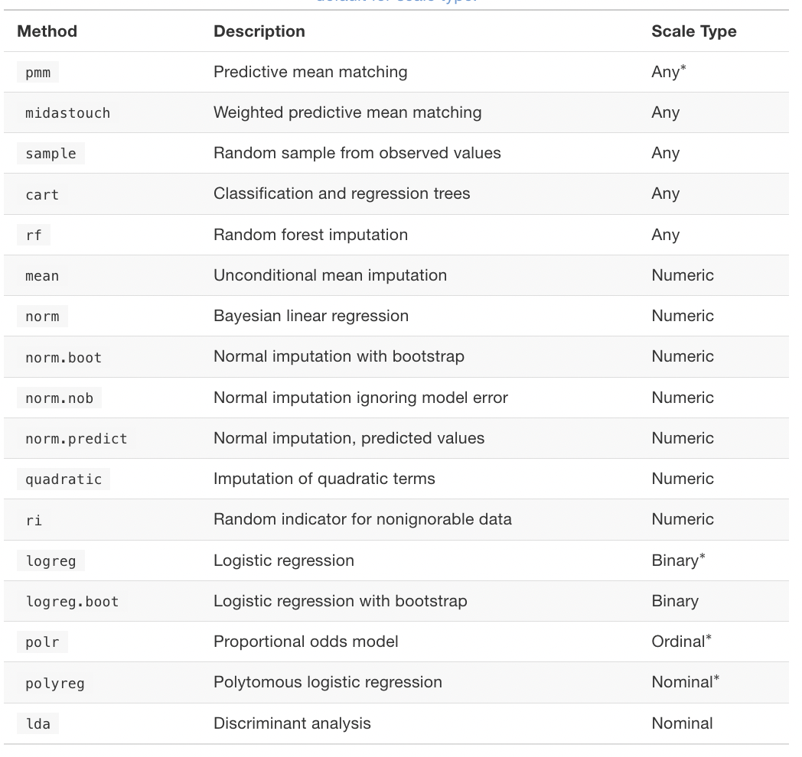

```{r setup, include=FALSE}
knitr::opts_chunk$set(echo = TRUE)
```

This is an R Markdown document. Markdown is a simple formatting syntax for authoring HTML, PDF, and MS Word documents. For more details on using R Markdown see <http://rmarkdown.rstudio.com>. *Please, be aware that the output of several chunks have been hidden for reducing the length of the current tutorial.* 

# Welcome!

In this tutorial, I assume you want to start working with multiple imputation and the *mice* package for a "good reason". By a good reason, I mean that you are aware that this is not the only way to work with NA values in your data frame. For instance, scholars also perform solutions such as "listwise deletion", "pairwise deletion", and "mean imputation". 

Even more important, you should be aware of some assumptions. In particular, the missing at random (MAR) assumption should be plausible. If you want to learn more about MAR and other assumptions, I recommend the following resources:

- [Missing Data Assumptions (MCAR, MAR, MNAR)- Video Tutorial by Stats with Mia](https://www.youtube.com/watch?v=YpqUbirqFxQ)
- [Stef van Buuren and Karin Groothuis-Oudshoorn (2011)](https://www.jstatsoft.org/article/view/v045i03)
- [Stef van Buuren (2018)](https://stefvanbuuren.name/fimd/sec-MCAR.html) 

The following tutorial is an introduction to the *mice* package and it is full of links to other resources as well.

# Set up

In this tutorial, I will use the following packages:

```{r}
library(tidyverse)
library(utils)
library(skimr)
library(viridis)
library(grDevices)
library(VIM)
library(mice)
library(stargazer)
```

I will use the R data frame `airquality` that contains 153 observations and 6 variables on daily air quality measurements in New York (May-September 1973). 

```{r air}
air <- airquality
```

# Checking NA

To begin with, I present different functions to explore missing values as well as options to visualize them.

## Exploring Missing Values

Before solving the NA issues, we need to recognize it. I like to apply different functions to identify the missing values in a dataset.

First, you can use simply `summary` and check the results. I pipe `as.data.frame()` just for a better visualization.

```{r summary,  eval=FALSE}
summary(air) %>% as.data.frame()
```

Another option is using `glimpse` from *tidyverse*. We can see our data as a tibble, which are "data.frames that are lazy and surly". If you want, learn more about tibbles in the [following link](https://tibble.tidyverse.org/).

```{r glimpse , eval=FALSE}
glimpse(air)
```
Third, we can use different base R functions. I use `sapply` to apply the same function to each column of the dataset and return a list. This is how sapply works: the first argument is the data, while the second one is the function. In this particular application, I identify if each value is a NA or not with `is.na` and use `sum` to aggregate the number of NA.

```{r sapply,  eval=FALSE}
sapply(air, function(x) sum(is.na(x)))
```

The *skimr* package provide several functions for exploring data. I like the function `skim_without_charts` for getting a great summary of data. I add `arrange` to sort the complete_rate (ranging from 0 to 1) and specify a descending order with `desc`.

```{r skim,  eval=FALSE}
skim_without_charts(air) %>%
  arrange(desc(complete_rate))
```

This is a great way to notice the variability in the number of NA. Columns such as Wind and Temp exhibit a complete rate of 1, while Solar.R shows a complete rate of 0.95 and 0.75, respectively. As you can notice, the rate is related to the number of missing values.

## Visualizing NAs

Graphs can provide an almost instant snapshot of what it is going on in your data. There are potentially multiple ways of visualizing missing values, but I will provide two options.

The first option is a heatmap that show stronger colors when the value of a variable are higher and lighter colors when they are lower. For such a graph, it is important to process the data a little bit. 

- I select first only the numeric columns. In this particular dataset, we do not need this step because all variables are numeric. However, it might not be the case and you would want to implement this code. 

```{r numeric, eval=FALSE}
air_numeric <- air %>%
  select(where(is.numeric)) 
```

- Additionally, I standardize the columns because they are in different scales. Otherwise, the intensity of colors will not be comparable.

```{r scale, eval=FALSE}
air_scaled <-scale(air)  
```

I plot this new data with `heatmap`. I specify a color palette with `viridis` function from the *viridis* package. Also, notice that I use the `jpeg` from the *grDevices* package to save this plot in high resolution.

```{r heatmap, eval=FALSE}
jpeg("heatmap2.jpg", res=300, width = 8, height=8, units="in")
heatmap(x=air_scaled, Colv = NA, Rowv = NA, 
        main = "
        Heatmap of Data Values", col = viridis(32, 1))
dev.off()

```

The actual output of the image will not appear in the HTML or PDF version of this tutorial. However, you can see the saved image here: 


{#id .class width="50%" height="80%" style="display: block; margin: 0 auto"}

A second graph is provided by the *VIM* package. The function `aggr` produces a histogram and a heatmap side by side in a very simple way:

```{r aggr, eval=FALSE}
jpeg("agg2.jpg", res=300, width = 8, height=8, units="in")
aggr(air_scaled, col=c('darkblue','darkred'), numbers=TRUE, sortVars=TRUE, labels=names(air_scaled), cex.axis=.7, gap=3, ylab=c("Histogram of missing data","Pattern"))
dev.off()
```

As in the previous case, the actual output of the image will not appear in the HTML or PDF version of this tutorial. However, you can see the saved image here:


{#id .class width="60%" height="80%" style="display: block; margin: 0 auto"}


These graphs will be more or less useful depending on the project, but the idea of visualizing missing data is appealing.

# Multiple Imputation by Chain Equations (MICE)

Let´s use `mice` from the *mice* packages. How does it work? As [Sam Wilson (2021)](https://cran.r-project.org/web/packages/miceRanger/vignettes/miceAlgorithm.html) puts it,

> *"The procedure 'fills in' (imputes) missing data in a dataset through an iterative series of predictive models. In each iteration, each specified variable in the dataset is imputed using the other variables in the dataset. These iterations should be run until it appears that convergence has been met."*

So, it might be tempting to start with the defaults of the function, but it is a better idea to start with a "dry imputation" at the beginning. For a dry imputation, I mean to set `maxit` (the maximum number of iterations) to zero. In practical terms, it means that I do not want to impute a whole data frame -- potentially taking several  minutes -- to realize things went pretty bad. I want to start first with a less demanding procedure.

## Dry Imputation

Notice that we are not doing an imputation yet. However, this code could still take a while:

```{r eval=FALSE}
air_dry <-mice(air, maxit = 0)
```

## Logged event 

The `mice` algorithm usually detect some issues and return them as *logged events* -- a list within the *mids* object that is created as an output. But is a short and clean data frame and there are no issues, so the logged events are NULL:

```{r logged, eval=FALSE}
air_dry$loggedEvents
```

I want to illustrate better how you would deal with a different situation. So, I follow [Nicole Erler's code](https://nerler.github.io/EP16_Multiple_Imputation/slide/07_convergence_and_diagnostics.pdf) to insert some modifications or "mistakes" in the dataset:

```{r changes}
air$dupl <- air[, 3] # Duplicate wind 
air$const <- 1 # Create a constant variable
air$Ozone[air$Temp > 75] <- NA # Set Temperate missing for Ozone>75
```

So, now we can re-run our dry imputation:

```{r miceagain, eval=FALSE}
air_dry2 <- mice(air, maxit=0)
```

The algorithm runs but it shows a warning: *Number of logged events: 2*. What it is going on here? The function is detecting problems. If you call the `loggedEvents` in the mids object (i.e. `mice` output), you find the exact issues and solutions already implemented:

```{r logged2, eval=FALSE}
air_dry2$loggedEvents 
```

The dataframe exhibits [five columns](https://nerler.github.io/EP16_Multiple_Imputation/slide/07_convergence_and_diagnostics.pdf):

- "it" refers to the iteration number
- "im" stands for imputation numbers
- "dep" refers to the dependent variable
- "met" is for method
- "out" stands for output

In this example, all values in the columns "it" and "im" are set to 0 because of the dry imputation. It means that these issues occurred *before* the imputation. In an actual imputation, rather than a dry one, the number in both columns might indicate the "stage" of the imputation where the issue is occurring. 

For the same reasons, there are no values in the "dep" column. However, in an actual imputation, this column will indicated the variable to be predicted in a particular model. Finally, "meth" indicates the issue (e.g., collinear, constant, or duplicate) and "out" exhibits the solution or variable(s) removed from the model for the dependent variable (the variables to be imputed). 

Let´s explore this output in more details:

```{r logged_view, eval=FALSE}
air_dry2$loggedEvents %>% View()
```

Notice that, in this particular example, the output show two rows, each corresponding to one variable that exhibits a particular issue. First, the output shows a constant: the column const. In real-world examples, you might experience other common situations. On the one hand, the code might not identify correctly your ID variables and it will consider them constants. On the other hand, sometimes variables with a extremely low variability or too many NA might also be considered a constant. 

A second row in the output highlights a variable with collinearity. It is the dupl variable I created. By default, `mice` remove both of them, but we can change this solution and include both variables anyways.

```{r cons_coll, eval=FALSE}
dry_cc <-mice(air, maxit = 0, remove.collinear=FALSE, remove.constant=FALSE)
```

If you call the logged events in this new object, you get a NULL result:

```{r logged_cc, eval=FALSE}
dry_cc$loggedEvents
```

However, it is not advisable to bypass these options. As Stef Van Bureen's (2018) book establishes, 

> *"...setting remove.constant = FALSE or remove.collinear = FALSE bypasses usual safety measures in mice, and could cause problems further down the road. If a variable has only NA’s, it is considered a constant variable, and will not be imputed. Setting remove.constant = FALSE will cause numerical problems since there are no observed cases to estimate the imputation model, but such variables can be imputed by passive imputation by specifying the allow.na = TRUE argument."*

So, let´s discuss two different options to navigate logged events:

1. We can make changes in the dataset and run the imputation, or
2. We can make change in the arguments passed to the `mice` function. 

# Changes in the dataset

In what follows, I will identify and remove constant and collinear variables *before* running a new imputation. 

## Dealing with constants

To begin with, I will remove the ID variables from the imputation. I also want to remove other problematic variables. So, I can explore the number of missing values one more time. In this case, I use `table` but you can also use the previous commands:

```{r nmis, eval=FALSE}
table(air_dry2$nmis)
```

The output shows six columns with 0 missing values, one with 7, and one with 111 NA. So, let´s work around these variables.

Let´s create a shorter version of the data frame for the imputation. I will reorder the variables, showing Month and Day first, and remove the constant variable. I am also creating an arbitrary threshold for this example: I remove all columns with more than a third of missing values. In actual implementation of *mice*, scholar might use completely different decisions depending on their knowledge of the data set and research questions. 

```{r short, eval=FALSE}
air_short <- select(air, Month, Day, everything(),
                    -const,
                    -where( ~ mean(is.na(.)) >= 0.33)) 
```

## Dealing with collinear

Let´s move to deal with PC. I will use the function `find.collinear` from *mice* to check PC in the new, clean dataset. I will create a vector with all the variables with this issue:

```{r var_collinear, eval=FALSE}
var_collinear <- mice:::find.collinear(air_short)
```

This function highlights 1 column creating this issue that I would like to remove. I do not need a complicated code for just one column. But an actual implementation of *mice* might result in several name columns withing this vector. So, I can remove all variables in the vector with the following code:

```{r select_all, eval=FALSE}
air_short<-select(air_short, -all_of(var_collinear))
```

### New Imputation

So, we finally run another dry imputation with only 5 variables of interest:

```{r imp1, eval=FALSE}
air_dry3 <- mice(air_short, maxit = 0)
```

### Removing all variables

As an alternative, you can eliminate all variables creating issues at once. 

```{r , eval=FALSE}
var_remove <-air_dry2$loggedEvents$out
```

Then, you remove all of them from the data frame. Notice that, although it is possible, I am not excluding here other variables (e.g., those exhibiting too many missing values).  

```{r, eval=FALSE}
air_short2 <- select(air, -all_of(var_remove))
```

Finally, you can run the dry imputation again.

```{r, eval=FALSE}
air_dry4 <- mice(air_short2, maxit=0)
```

## Changing the defaults

The function `mice` has a long list of default parameters. I cannot show here how all them work. Also, notice that we have already introduced some changes above when setting `remove.collinear=FALSE` and `remove.constant=FALSE`. However, I do want to make some extra changes.

First, let's return to our last dry imputation and save the predictor matrix and the methods' output.

```{r saving, eval=FALSE}
predictors <-air_dry4$predictorMatrix
methods<-air_dry4$method
```

By default, `mice` is using both objects (i.e., predictors and methods). As a result, both imputations below will result in the same output:

```{r imp1_2, eval=FALSE}
imp1 <- mice(air_short2)
imp2 <-mice(air_short2, predictorMatrix = predictors, method = methods)
```

Nevertheless, it is possible to introduce some changes in both predictors and methods as I discuss in what follows.

### Predictor Matrix

The function `mice` provides a predictor matrix or a square matrix with values 0 and 1. The rows specify the dependent variables and the columns the predictors. As a result, 1 indicates that the variable in the row is a predictor, while 0 means the opposite. Accoding to Van Buuren and Groothuis-Oudshoorn (2011: 15), 

> *"The general advice is to include as many relevant variables as possible including their interactions (Collins et al. 2001). This may however lead to unwieldy model specifications that could easily get out of hand."* 

How can you change the default? One alternative is to use `quickpread` that, as it name indicates, delivers a "quick selection of predictors from the data." You can read more about this function by calling the help (i.e. ?quickpread).  

```{r quickpread, eval=FALSE}
new_matrix <- quickpred(air_short2)
```

In this output, you do not longer have all variables as predictors. Notice that the new matrix is removing some variables as predictors. For instance, Solar.R, Ozone, and Wind exhibit just one predictor. 

After creating this matrix, you can include it in the imputation.

```{r imp3, eval=FALSE}
imp3 <-mice(air_short2, predictorMatrix = new_matrix)
```

You do not need to use a new matrix from scratch. You can actually modify an existing one. For instance, let's consider again the predictors matrix from the dry imputation. Indexing allows modifying rows (i.e., dependent variables) and columns (i.e,, predictors). 

For instance, I can remove the first column (i.e., Month) as a predictor of all variables. 

```{r first_col, eval=FALSE}
predictors[,1]=0
```

You can also remove several variables at the same time. You can use the column number or its name. For example, I am removing both Month and Temp as predictors:

```{r several_col2, eval=FALSE}
predictors[, c("Month", "Temp")]=0
```

Another option is to modify one or more predictor of a single dependent variable. For instance, I am specifying that Month and Temp are predictors of the second column (i.e., Day). 

```{r several_col, eval=FALSE}
predictors[2, c("Month", "Temp")]=1
```

In sum, indexing allows multiples changes in the predictors for one or multiple dependent variables. After any of these modifications, you can run a new imputation by modifying the `predictorMatrix` argument.

### Methods

Mice applies an imputation method for each variable exhibiting NA. Let's run again the methods object we saved above.

```{r method, eval=FALSE}
methods
```

You can notice two types of variables. Those columns showing empty quotation marks are not dependent variables. In this default methods object, they are not going to be imputed because they do not exhibit NA values. By contrast, Ozone and Solar.R are dependent variables. They are going to be imputed with the pmm method. Pmm stands for [Predictive Mean Matching](https://cran.r-project.org/web/packages/miceRanger/vignettes/miceAlgorithm.html#:~:text=miceRanger%20can%20make%20use%20of,value%20of%20the%20missing%20sample.), a common method in *mice* that applies to different scales.  

The package has many other methods. Van Bureen's (2018) book summarizes most of them in the following table:


{#id .class width="80%" height="80%" style="display: block; margin: 0 auto"}

Let´s introduce some modification. Again, I will use indexing. 

For example, I can remove some variable as a dependent variable. As a result, I will not impute them.

```{r remove, eval=FALSE}
methods[3]=""
```

Another option is to change several variables at the same time. For example, I can change the method from pmm to cart (Classification and Regression Trees) using their position number or their name.

```{r car, eval=FALSE}
methods[c("Ozone", "Solar.R")]="cart"
```

Evidently, many other modifications are possible. At the end, you can customize the methods for a particular column depending on your decisions as a researcher. 

### Number of imputed datasets and iterations

Finally, it is useful to notice that `mice` is choosing the number of imputed data frames. For example, I specify below that `m` equals 5 in order to get five imputed data frames. Likewise, `maxit` is specifying the number of iterations to create the imputation. I am asking for 20 iterations.  

```{r m_maxit, eval=FALSE}
imp3 <- mice(air_short2,
             m = 5,
             maxit = 20)
```

The number of imputation is important for reaching convergence, a topic I will not discuss here in further details. If you want to learn more about it, you can visit [this link](https://nerler.github.io/EP16_Multiple_Imputation/slide/07_convergence_and_diagnostics.pdf). This presentation provides useful guidance to visualize convergence in different ways.

Finally, the number of imputed data frames is key to understand the next section dedicate to work with `mice` output. 

# Working with imputed data

To finalize this tutorial, I would like to present very briefly how to work with the imputed data frames.

Let's pretend I want to run a simple multivariate regression model where temperature is the dependent variable, Solar.R is the independent variable, and Ozone and Wind are controls. I use `with` to specify I want to perform such computation of each of imputed datasets. 

```{r imputed, eval=FALSE}
imputed_lm <- with(imp3, lm(Temp ~ Solar.R + Ozone  + Wind))
```

As a result, I have five different regression analysis. I can call separately each of them and even save the result. For instance, I will save the first regression analysis, corresponding to my first imputed data.   

```{r imputed1, eval=FALSE}
imputed1_lm <- imputed_lm$analyses[[1]]
```

Now, I can visualize the output using packages such as stargazer. 

```{r stargazer, eval=FALSE}
stargazer(imputed1_lm, type = "text")
```

Finally, you can also pool the results from all your imputed data frames rather than present them separately. 

```{r list, eval=FALSE}
pooled_result <-pool(imputed_lm)
```